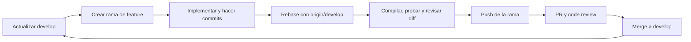

# Plan A · Feature branching para Android

Este documento convierte el Plan A de Android en una secuencia de ramas pequeñas. Cada rama contiene una sola capacidad verificable, nace desde `develop`, se actualiza contra `origin/develop` antes del push y se integra mediante PR con revisión de otra persona.

## 1. Estado actual y resguardo inicial

Estado observado al preparar este plan:

- La copia local está en `main`.
- `origin/develop` contiene trabajo que todavía no está en `main`.
- El scaffold Android, el sistema de diseño y el frontend están sin commit.
- El entorno actual no dispone de JDK/Gradle, por lo que el código Android creado aún no fue compilado.

No se debe commitear este trabajo directamente en `main` ni cambiar de rama con archivos sueltos. Primero se crea una instantánea local recuperable:

```bash
git switch -c wip/android-ui-snapshot
git add .gitignore build.gradle.kts settings.gradle.kts gradle.properties app design-system docs front
git diff --cached --check
git commit -m "wip(android): resguardar scaffold y diseño"
```

La rama `wip/android-ui-snapshot` es solo un respaldo local: no se integra ni se abre como PR. Las features recuperan desde ella únicamente los archivos que les corresponden.

Después:

```bash
git fetch origin
git switch -c develop --track origin/develop
```

Si `develop` ya existe localmente:

```bash
git switch develop
git pull --ff-only origin develop
```

## 2. Reglas del flujo

1. No hacer push directo a `main` ni `develop`.
2. Cada rama nace del último `origin/develop` y resuelve una sola feature.
3. No empezar la siguiente rama hasta que la anterior esté integrada en `develop`, salvo trabajo paralelo de otra persona en archivos que no se superponen.
4. No cambiar de rama con cambios pendientes: hacer un commit coherente o guardarlos explícitamente.
5. Antes del primer push, actualizar la rama con `origin/develop`, compilar, revisar el diff y ejecutar las pruebas de esa feature.
6. El PR siempre usa `base: develop`; requiere al menos una aprobación de alguien que no sea el autor.
7. Solo `develop` validado en el teléfono puede promoverse a `main`.



## 3. Alcance visual cerrado

- No existen vistas de Martina ni una experiencia familiar.
- La pantalla inicial pertenece al usuario protegido.
- La pantalla inicial muestra primero la cantidad de notificaciones bloqueadas.
- Luego muestra `Bloqueadas` y `Confiadas`, con motivo y momento del evento.
- `Confiar` mueve solo ese evento a Confiadas; no crea una excepción permanente para todo el remitente.
- `Desconfiar` devuelve ese evento a Bloqueadas.
- La pantalla incluye el estado y acceso a los permisos del sistema.
- Un resultado `HIGH` cancela la notificación detectada y abre automáticamente la alerta invasiva.
- La alerta tiene un único CTA: `ENTENDIDO`.
- No se depende de tocar una notificación propia para abrir la alerta.

Este alcance modifica el Plan A original: el overlay deja de ser opcional y la apertura manual desde una notificación deja de ser el flujo principal.

## 4. Backlog de ramas

Los nombres no llevan prefijo para respetar la convención actual del repositorio.

| Orden | Rama | Plan A | Contenido | Criterio de aceptación |
| --- | --- | --- | --- | --- |
| 0 | `a00-compose-foundation` | F-00 | Gradle, módulo `app`, Manifest mínimo, tema Compose y tokens del design system | La app compila y abre una pantalla vacía tematizada en el teléfono |
| 1 | `a03-blocked-home-ui` | A-03 | Resumen con cantidad, pestaña Bloqueadas y cards con origen, fragmento, motivo y fecha | Datos simulados se ven correctamente en teléfono pequeño y con fuente ampliada |
| 2 | `a03-trusted-events-ui` | A-03 | Pestaña Confiadas, acciones `Confiar`/`Desconfiar`, empty states y feedback | Un evento cambia de lista sin duplicarse y la acción inversa lo restaura |
| 3 | `a04-system-permissions-ui` | A-04 | Estado real de acceso a notificaciones y permiso de overlay; botones que abren ajustes correctos | Al volver de Ajustes, cada permiso muestra su estado real sin reiniciar la app |
| 4 | `a02-critical-alert-ui` | A-02 | Pantalla roja adaptable, evidencia no interactiva, motivo, recomendación y `ENTENDIDO` | Se mantiene legible al 200 %, no abre enlaces y `ENTENDIDO` cierra la alerta |
| 5 | `a01-notification-capture` | A-01 | `NotificationListenerService`, extracción mínima, exclusión de Freno y evento interno | Recibe una fuente real con la app en segundo plano sin registrar texto sensible |
| 6 | `a05-event-policy` | A-05 | Normalización, deduplicación, estados y contrato `RiskAnalyzer`; inicialmente fake | Repetición idéntica no duplica; cambio de texto crea un evento nuevo |
| 7 | `a05-auto-overlay` | A-02/A-05 | Cancelación de notificación `HIGH` y apertura automática usando el permiso de overlay | HIGH interrumpe automáticamente; LOW/UNKNOWN no se presentan como seguros |
| 8 | `a03-room-history` | A-03 | Room, máximo 100 eventos, actualización por `eventId` y persistencia de confianza | Cerrar/reabrir conserva listas, motivos y acciones; borrar elimina de Room |
| 9 | `a06-backend-analyzer` | A-06 | Cliente Ktor y conexión con el contrato del backend | Resultado real actualiza el `eventId` correcto y conserva el motivo original |
| 10 | `a07-accessibility-failures` | A-07 | Permisos retirados, red, contenido incompleto, privacidad en bloqueo y accesibilidad | Sin crashes; fuente al 200 %; overlay cerrable; fallos visibles y honestos |

## 5. Dependencias

```text
a00-compose-foundation
├── a03-blocked-home-ui
│   └── a03-trusted-events-ui
│       └── a03-room-history
├── a04-system-permissions-ui
├── a02-critical-alert-ui
└── a01-notification-capture
    └── a05-event-policy
        ├── a05-auto-overlay
        └── a06-backend-analyzer

Todo lo anterior ──> a07-accessibility-failures
```

El orden recomendado es el de la tabla. La alerta visual y la captura pueden desarrollarse en paralelo únicamente si las hacen personas distintas y acuerdan antes el modelo `FrenoEvent`.

## 6. Ciclo exacto de cada feature

### 6.1 Crear la rama

```bash
git switch develop
git pull --ff-only origin develop
git switch -c a03-blocked-home-ui
```

Si la feature ya existe en la rama de resguardo, traer solo sus archivos:

```bash
git restore --source wip/android-ui-snapshot -- app/src/main/java/com/grupo3/freno/ui
```

No restaurar todo `app/` automáticamente: eso mezclaría Manifest, permisos, listener y otras features.

### 6.2 Implementar y commitear

Usar commits pequeños y semánticos:

```text
feat(android): agregar resumen de bloqueos
feat(android): mostrar motivo y fecha en cada evento
test(android): cubrir cambio entre listas
docs(android): registrar prueba en dispositivo
```

Antes de cada commit:

```bash
git diff --check
git status --short
git diff
```

### 6.3 Integrar el último `develop` antes del push

Para una rama individual que todavía no fue publicada:

```bash
git fetch origin
git rebase origin/develop
```

Si aparecen conflictos:

```bash
git status
# Resolver cada archivo y revisar que conserve ambas intenciones.
git add <archivo-resuelto>
git rebase --continue
```

No usar `git rebase --skip` para ocultar conflictos ni `git reset --hard` para resolverlos.

### 6.4 Quality gate local

Cuando el entorno Android esté instalado:

```bash
./gradlew lintDebug testDebugUnitTest assembleDebug
git diff --check
git diff --stat origin/develop...HEAD
git diff origin/develop...HEAD
```

Además, probar en el teléfono lo que corresponda a la rama. Una feature de permisos, captura u overlay no queda aprobada solo con Preview.

### 6.5 Push y PR

```bash
git push -u origin HEAD
```

Crear el PR con:

- **Base:** `develop`
- **Compare:** la rama de feature
- Título: `[A-03] Historial inicial de notificaciones bloqueadas`
- Un solo objetivo funcional.
- Captura o video para cambios visuales.
- Pruebas ejecutadas y dispositivo usado.
- Riesgos, permisos o limitaciones conocidos.

## 7. Revisión de código obligatoria

El autor hace primero una auto-revisión del diff completo. Luego otra persona revisa el PR.

### Checklist general

- [ ] La rama contiene únicamente la feature declarada.
- [ ] No incluye secretos, APK, cachés, `.idea`, `build/` ni archivos de scrcpy.
- [ ] Compila desde un clon limpio o desde `develop` actualizado.
- [ ] No rompe el contrato compartido ni modifica archivos del backend sin coordinación.
- [ ] Errores y estados vacíos tienen una salida comprensible.
- [ ] El PR documenta qué fue probado y qué quedó fuera.

### Checklist UI/UX

- [ ] Usa tokens de `FrenoTheme`, sin colores o tamaños arbitrarios repetidos.
- [ ] Todos los objetivos táctiles miden al menos 48 dp.
- [ ] El significado no depende únicamente del color.
- [ ] TalkBack recibe etiquetas útiles y un orden lógico.
- [ ] La interfaz funciona con fuente al 200 % y en 360 × 800.
- [ ] Las acciones `Confiar` y `Desconfiar` explican su alcance y son reversibles.
- [ ] No aparece ninguna vista, nombre o acción destinada a Martina.
- [ ] La alerta conserva un solo CTA prominente y ningún enlace interactivo.

### Checklist Android y privacidad

- [ ] El listener retorna rápido y no realiza red en el callback.
- [ ] No se registran mensajes, códigos, teléfonos ni URLs completas.
- [ ] Se ignoran las notificaciones generadas por Freno.
- [ ] El overlay solo se intenta con permiso concedido y tiene cierre claro.
- [ ] Pantalla bloqueada y permisos retirados no exponen contenido ni producen crash.
- [ ] La app no promete que un mensaje es seguro ni que verificó una identidad.

El reviewer puede marcar:

- `blocking`: debe corregirse antes del merge.
- `suggestion`: mejora no bloqueante.
- `question`: requiere aclaración del autor.

Toda conversación `blocking` debe quedar resuelta antes de aprobar.

## 8. Integrar y comenzar la siguiente rama

Después de aprobación y checks verdes, hacer **Squash and merge** hacia `develop`. El commit final debe conservar el ID de la tarea.

Luego:

```bash
git switch develop
git pull --ff-only origin develop
git branch -d <rama-integrada>
git switch -c <siguiente-rama>
```

La siguiente feature debe partir de este nuevo `develop`; no debe partir de la rama anterior ni reutilizar una rama ya mergeada.

## 9. Promoción de `develop` a `main`

Abrir un único PR `develop → main` cuando se cumpla lo siguiente:

- APK debug/release generada desde `develop` integrado.
- App instalada en el POCO de la demo.
- Permisos de notificaciones y overlay comprobados.
- Notificación sintética HIGH cancelada y alerta abierta automáticamente.
- Listas Bloqueadas/Confiadas persistentes y reversibles.
- Motivo y momento del bloqueo visibles.
- Fuente al 200 %, cierre, reinicio y retiro de permisos probados.
- Dos ensayos completos y video de respaldo.

`main` representa una versión demostrable; no se usa como rama de desarrollo.
